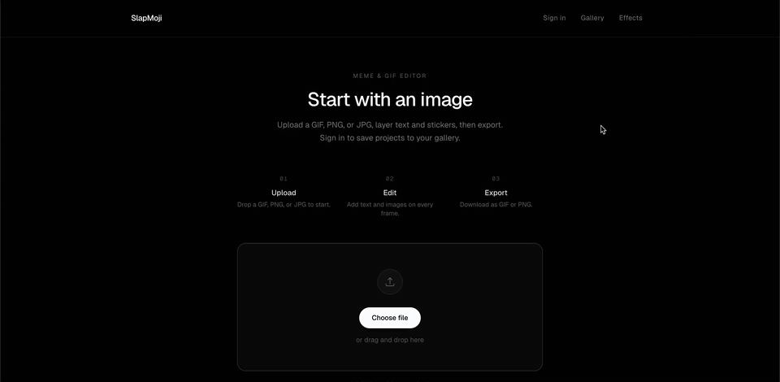
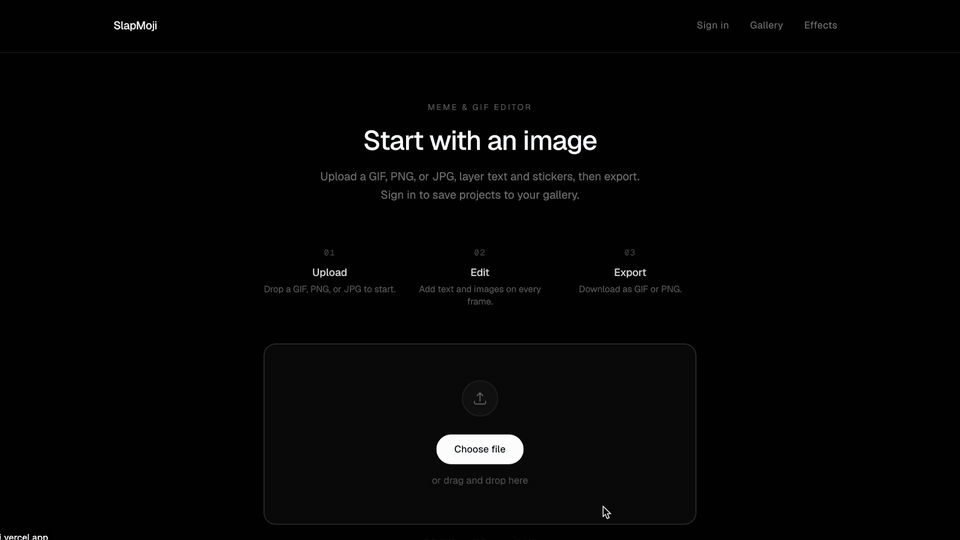

# SlapMoji

Make a GIF for your Slack emoji/Discord emote!

### Editor



[Full editor walkthrough (MP4)](docs/assets/slapmoji-demo.mp4)

### Final result

<p align="center">
  
</p>

<p align="center"><em>Layered frames exported as a GIF — drop it straight into Slack or Discord.</em></p>

### Effects



[Full effects walkthrough (MP4)](docs/assets/slapmoji-effects.mp4)


| Frame 1 | Frame 2 |
| :---: | :---: |
|  |  |

Monorepo: **Next.js** frontend in [`web/`](web/) and **Spring Boot** API in [`backend/`](backend/).

## Getting Started

Install and run the web app (requires [pnpm](https://pnpm.io)). Dependencies and `pnpm-lock.yaml` live only under `web/` so Vercel can use **Root Directory → `web`** without a workspace install.

```bash
cd web && pnpm install
pnpm dev   # from repo root (runs web dev)
```

Open [http://localhost:3000](http://localhost:3000). The UI lives under `web/app/`.

Run the API locally (Java 17+):

```bash
cd backend && ./mvnw spring-boot:run
```

Health check: [http://localhost:8080/api/health](http://localhost:8080/api/health).

## Deploy

### Vercel (frontend)

In the Vercel project, set **Root Directory** to **`web`** (Settings → General). Use the folder name only—**not** `/web`. Under **Framework Preset**, use **Next.js** or **Auto**.

[`web/pnpm-lock.yaml`](web/pnpm-lock.yaml) must be committed next to [`web/package.json`](web/package.json). [`web/vercel.json`](web/vercel.json) only sets the Next preset; the default `pnpm install` runs inside `web`.

**`NEXT_PUBLIC_API_URL`:** [`web/next.config.ts`](web/next.config.ts) defaults to `https://slapmoji-production.up.railway.app`. Override in Vercel → Environment Variables if needed (no trailing slash). See [`web/.env.example`](web/.env.example).

### Railway (API)

Create a service from this repo and set **Root Directory** to `backend`. Railway’s Nixpacks builder runs Maven and starts the executable JAR.

Set **`SLAPMOJI_CORS_ORIGINS`** to your Vercel origin (comma-separated if you have several), e.g. `https://your-app.vercel.app`, so browser requests from the deployed site are allowed.

This project uses [`next/font`](https://nextjs.org/docs/app/building-your-application/optimizing/fonts) to load [Geist](https://vercel.com/font).
